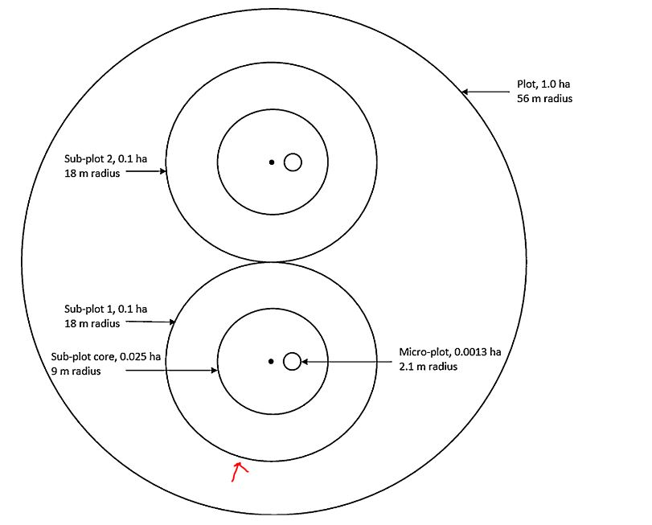

# codeblitz2: Plot-based forest metrics in R

## Background 

This is a team exercise designed to help us get more comfortable with 
**collaborative coding in R** and **using GitHub** for ecological problem-solving.  

This Code Blitz helps us build reusable tools and skills that will ultimately 
allow us to process LiDAR and forest monitoring data efficiently. The code here
will  build toward a lab project where we use **aerial LiDAR data** to provide
detailed assessments of **basal area, density, and tree size** across all of 
the property for multiple years. This will be  valuable contribution to research
and conservation departments.

To train advanced models, we’ll need strong training data — and the Jones
Center’s long-term forest monitoring program gives us a great foundation.  

## 🎯 Products and Goals

By the end of this Code Blitz, we will

* Learning goals
  - Learn how to **write functions in R**  
  - Practice **basic forest structure equations** (BA, density, QMD, canopy cover)  
  - Build teamwork skills in **collaborative coding with GitHub**  
  - More hands-on experience with GitHub branching, merging, and collaborative coding
* Research products
  - A set of reusable R functions for forest metrics
  - Summary graphs of key forest structure metrics
  - Training data for site-wide structural assessments

---

## Ichauway Long-term forest monitoring plots (LTM)

At each plot, field crews:  
- Measure all trees >10 cm DBH within a fixed-radius plot (radius = 18m, area = 0.10ha/0.25 ac).  
- Tag and identify trees to species (using internal species codes).  
- Map all trees using distance and azimuth (which we can convert to XY coordinates).  

</img>

Schematic of a single LTM plot. All of the data we are working with come 
from the 18 m diameter **Subplot 1**

---

## 🛠️ Getting Started / Requirements

Before you begin, make sure you have:  

- **R** and **RStudio** installed  
- Access to the **Jones Center R: drive** (for main datasets)  At least one
person per team
- Git installed and configured (check with `git --version` in your terminal)  
- A GitHub account  
- 💡 See [codeblitz1](https://github.com/landeco-jonesctr/codeblitz1/) if you 
need a refresher on this.

### Required R Packages
We’ll use the following packages during this exercise:  

```r
install.packages("tidyverse") #contains dplyr, ggplot2, readr, etc.
```
---

## Getting Back on GitHub
1. ✅ Make sure someone on your team has **direct R drive access**  
2. ✅ In **RStudio**:  
   - Go to **File > New Project > Version Control**  
   - Select **Git**, then paste in this repo link:  
     ```
     https://github.com/landeco-jonesctr/codeblitz2
     ```
   - Choose a local folder to store the repo  
3. ✅ Create your own **team branch** (pick one person to lead this)  
4. ✅ Create a new `team.R` file to write and submit your code
4. ✅ Work with your team to complete your assigned task  
5. ✅ Save, commit, and push your changes to GitHub  
6. ✅ Submit a pull request, so we can merge your updates.
6. ✅ Select someone to present your code to the group  

---

## ⚙️ Group Work 1: Functions (20–30 min)

You’ll be divided into **4 groups**, each tackling a coding task:  

Data for the exercise can be found here:

`'R:/landscape_ecology/codeblitz/codeblitz2/ltm-data.csv'`

### Group 1: Species Lookup
- Write an R function to convert **species codes → full names**  
- Input: vector of species codes  
- Output: species names  
- Add error checking (e.g., bad inputs)  
- Make it **case insensitive** (bonus)  

### Group 2: Basal Area
- Write an R function to calculate **basal area (m²/ha)**  
- Make sure units are correct (dbh in cm)  
- Handle missing values (`NA`)  

### Group 3: Quadratic Mean Diameter (QMD)
- Write an R function to calculate **QMD at the plot level**  

### Group 4: Canopy Cover
- Write an R function to summarize **canopy cover** at the plot level  
- Use densiometer measurements (usually an average of 4 readings per plot)  

### Dataset Output Guidance

**Preferred format:** Shapefile (for spatial outputs) or CSV (simpler summary tables).

Each team should include the following columns:

`Plot | Year | BA | Density | QMD | UTMX | UTMY`

**Naming conventions:** Shapefile: `Ichuway_BA.shp`, `Ichuway_Density.shp`, `Ichuaway_QMD.shp`

---

### 🩺 Anatomy of an R Function

Here’s a quick template you can adapt:  

```r
# Anatomy of a function in R
my_function <- function(input1, input2 = default_value) {
  # Do something with the inputs
  result <- mean(input1, na.rm = TRUE)
  
  return(result)
}

# Example: a simple average function using sum() and length()
average <- function(x) {
  if (!is.numeric(x)) stop("Input must be numeric!")
  x <- x[!is.na(x)]        # remove NAs
  if (length(x) == 0) return(NA)  # return NA if all inputs missing
  return(sum(x) / length(x))
}
```

### Resources for Part 1

*  Long-term monitoring data article: [Holland et al. 2019 *Journal for Nature Conservation*](https://www.sciencedirect.com/science/article/abs/pii/S1617138118302553)
* 📘 [Basal area calculation](https://www.youtube.com/watch?v=he6rpCpFaas)
* 📊 [Quadratic mean diameter calculation](https://en.wikipedia.org/wiki/Quadratic_mean_diameter)
* 🌳 [Spherical densiometer](https://www.youtube.com/watch?v=BavU4qicBXE)
* 💻 [Writing functions in R](https://bookdown.org/rdpeng/rprogdatascience/functions.html#your-first-function)

### Function names and info, examples
```
# Species lookup
lookup_species <- function(codes) {
  # input: character vector of codes
  # output: character vector of species names
}

# Basal area
calc_ba <- function(dbh_cm) {
  # input: numeric vector of DBH in cm
  # output: numeric basal area in m^2/ha
}

# QMD
calc_qmd <- function(dbh_cm) {
  # input: numeric vector of DBH per plot
  # output: numeric QMD in cm
}

# Canopy cover
avg_canopy <- function(readings) {
  # input: numeric vector of 4 readings
  # output: average canopy cover (%)
}
```

| Function | Input | Output | Notes / Error Handling |
|----------|-------|--------|----------------------|
| **Species Lookup** | Vector of species codes (character) | Vector of full species names (character) | Should handle unknown codes (`NA`) and ignore case |
| **Basal Area (BA)** | Vector of DBH (cm) | Numeric basal area in m²/ha | Remove NAs; DBH must be numeric |
| **Quadratic Mean Diameter (QMD)** | Vector of DBH (cm) per plot | Numeric QMD (cm) | Remove NAs; return NA if no trees |
| **Canopy Cover** | Vector of densiometer readings per plot | Numeric canopy cover (%) | Usually average of 4 readings; remove NAs |

---

## 📊 Group Work 2: Main Dataset (20 min)

Now, let’s apply what you built to the main dataset (on the R drive).

⚠️ These data are not public, so make sure someone on your team has R drive access.

### Teams & Tasks:

* Team Root: Calculate total BA for all plots by year
* Team Shoot: Calculate density for all plots by year
* Team Bark: Calculate QMD for all plots by year
* For all teams:
  - Make a graph of your average statistic by year
  - Make another graph of your statistic by year for the 5 major species
  - (Bonus) Add standard error bars

Hint, for summarizing data use the `tidyverse` package which contains
the function `group_by` and `summarize`

```
# choose the dataset and the groups you want to summarize by
mydata = group_by(mydata, Plot, Year)

# summarize the output using statistics like mean, median, or sd
output = summarize(mydata, )

# You can chain them using the pipe operator %>%
output %>% group_by(Plot, Year) %>% 
  summarize(ba_mean = mean(basal_area), ba_sd = sd(basal_area))
```

### GitHub Workflow for Group Work 2

* ✅ Switch back to the main branch
* ✅ Pull to update your local copy
* ✅ Switch back to your team branch
* ✅ Merge updates from main:
    in the Terminal type `git merge main`

--- 

## 🧩 Final Steps (Core Staff Only)

✅ Please complete this within two weeks

Team: Leah, Khanh, Tanner, Carly, Tristen

Compile everyone’s outputs into one shapefile or table:

| Plot | Year | BA | Density | QMD | UTMX | UTMY |
|:----:|:----:|:--:|:-------:|:---:|:---:|:---:|
| 1    | 2020 | x  | x       | x   | x   | y   |
| 1    | 2021 | x  | x       | x   | x   | y   |
| 1    | 2022 | x  | x       | x   | x   | y   |
| 2    | 2020 | x  | x       | x   | x   | y   |
| 2    | 2021 | x  | x       | x   | x   | y   |
| 2    | 2022 | x  | x       | x   | x   | y   |


Each row = plot × year summary of:

* Live basal area
* Tree density
* Quadratic mean diameter

---

